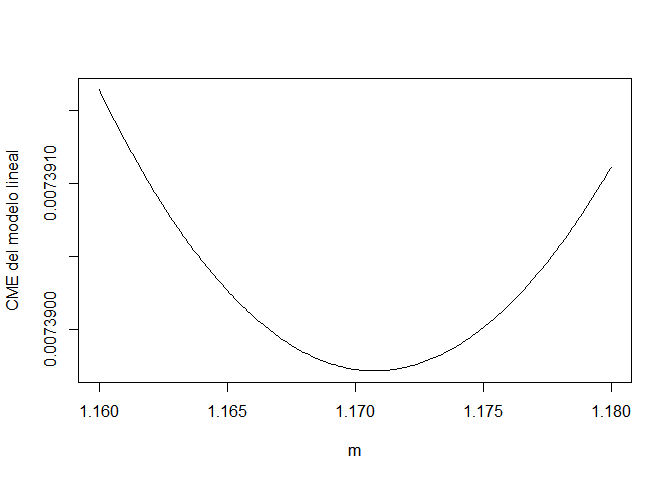
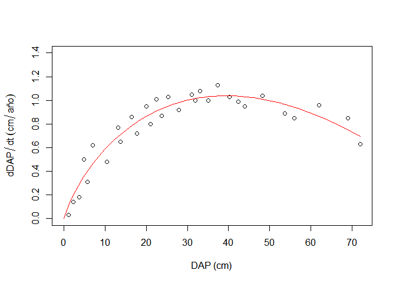
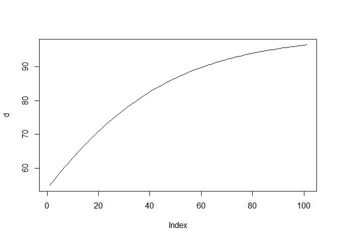
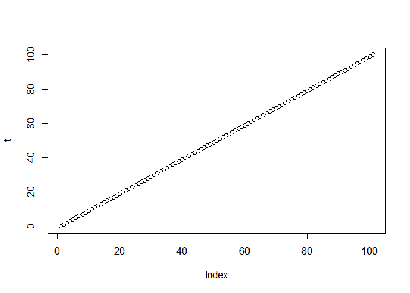
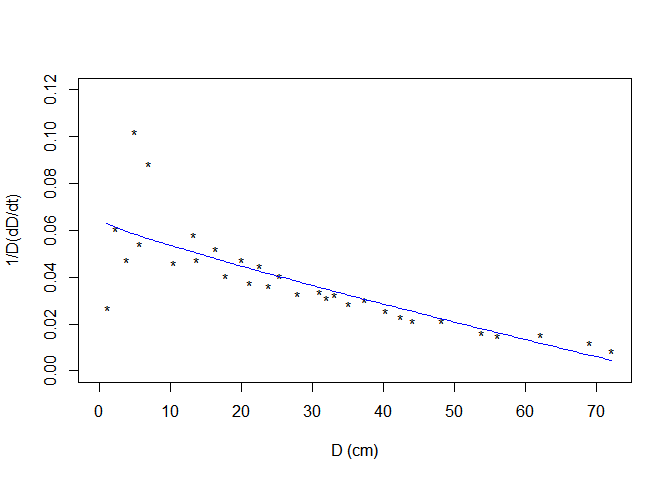
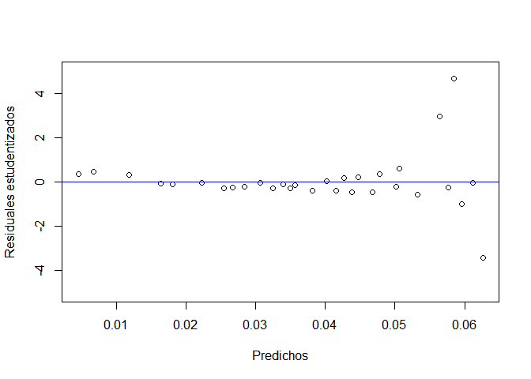
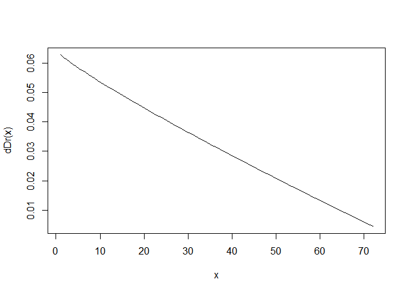

Bertalanffy ecuation: forest ecology 2015
================

## Data

The variables in data are D (Diameter hight chest) and dD (derived in
time of diameter). This was an exercise for the forest ecology class in
2015.

``` r
datos<-read.csv2("datos.csv")
colnames(datos)=c("D","dD")
head(datos)
```

    ##     D   dD
    ## 1 1.1 0.03
    ## 2 2.3 0.14
    ## 3 3.8 0.18
    ## 4 4.9 0.50
    ## 5 5.7 0.31
    ## 6 7.0 0.62

## Estimate m function

The function *estimar.m* estimate m in W W^m + w - 1

``` r
estimar.m<-function(dw,w,datos,x,y,z){
        m=seq(x,y,z)
        CME<-function(mod){
                cme= CME=anova(mod)$Mean[length(anova(mod)$Mean)]
        }
        cme=vector()
        for(i in 1:length(m)){
                mod<-lm(dw~I(w^m[i])+w-1,datos)
                cme[i]=CME(mod)
        } 
        plot(m,cme,type="l", xlab="m",ylab="CME del modelo lineal")
        data=data.frame(cme,m)
        print(data[which.min(data$cme),]) 
}
```

The m value which minimum square mean error was 1.1708.

``` r
estimar.m(datos$dD,datos$D,datos,1.16,1.18,0.0001)
```

<!-- -->

    ##             cme      m
    ## 109 0.007389716 1.1708

``` r
m=1.1708
mod<-lm(dD~I(D^m)+D-1,datos)
summary(mod)
```

    ## 
    ## Call:
    ## lm(formula = dD ~ I(D^m) + D - 1, data = datos)
    ## 
    ## Residuals:
    ##      Min       1Q   Median       3Q      Max 
    ## -0.12055 -0.07609 -0.03066  0.07672  0.15955 
    ## 
    ## Coefficients:
    ##         Estimate Std. Error t value Pr(>|t|)    
    ## I(D^m) -0.082361   0.003411  -24.15   <2e-16 ***
    ## D       0.180611   0.006611   27.32   <2e-16 ***
    ## ---
    ## Signif. codes:  0 '***' 0.001 '**' 0.01 '*' 0.05 '.' 0.1 ' ' 1
    ## 
    ## Residual standard error: 0.08596 on 29 degrees of freedom
    ## Multiple R-squared:  0.9901, Adjusted R-squared:  0.9894 
    ## F-statistic:  1450 on 2 and 29 DF,  p-value: < 2.2e-16

``` r
anova(mod)
```

    ## Analysis of Variance Table
    ## 
    ## Response: dD
    ##           Df  Sum Sq Mean Sq F value    Pr(>F)    
    ## I(D^m)     1 15.9115 15.9115 2153.19 < 2.2e-16 ***
    ## D          1  5.5147  5.5147  746.27 < 2.2e-16 ***
    ## Residuals 29  0.2143  0.0074                      
    ## ---
    ## Signif. codes:  0 '***' 0.001 '**' 0.01 '*' 0.05 '.' 0.1 ' ' 1

``` r
(n=summary(mod)$coefficients[1,1]) #Catabolismo
```

    ## [1] -0.08236057

``` r
(g=summary(mod)$coefficients[2,1]) #Anabolismo
```

    ## [1] 0.1806107

## Bertalanffy model

``` 
            \frac{\delta D}{\delta t}
```

``` r
{
        op <- par(mar = c(5,4.5,4,2) + 0.1)
        with(datos, plot(D,dD,xlab="DAP (cm)", ylab=expression(dDAP/dt~(cm/año)), 
                 xlim=c(0,72), ylim=c(0,1.4)))
        par(new=TRUE)
        curve(n*(x^m)+g*x, xlab="",col="red", 
        ylab="", xlim=c(0,72), ylim=c(0,1.4), axes=FALSE)

}
```

<!-- -->

### Load capacity

``` 
            $\frac{\delta D}{\delta t}= 0$
```

``` r
dD=n*(datos$D^m)-g*datos$D
k=(g/(-1*n))^(1/(m-1))
```

### Growth rate at which function is maximized

``` r
dD2=(-g/(n*m))^(1/(m-1)) 
dDmax=n*(dD2^m)+g*dD2
```

``` r
A=((-n/g)^(1/m-1))
b=1-(1.1/A)^(1/(m-1))
t=seq(0,100,1)
D=k*(1+b*exp(g*(1-m)*t))^(1/(1-m))
plot(D, type="l")
```

<!-- -->

``` r
D<-function(t, m, n, g ){
        k=(g/(-1*n))^(1/(m-1))
        A=((-n/g)^(1/m-1))
        b=1-(1.1/A)^(1/(m-1))
       D=k*(1+b*exp(g*(1-m)*t))^(1/(1-m))
       print(D)
}
```

``` r
d<-D(t, m, n, g)
```

    ##   [1] 54.85198 55.80082 56.73924 57.66684 58.58325 59.48816 60.38124 61.26221
    ##   [9] 62.13083 62.98685 63.83009 64.66037 65.47752 66.28141 67.07194 67.84902
    ##  [17] 68.61257 69.36256 70.09894 70.82171 71.53086 72.22643 72.90844 73.57694
    ##  [25] 74.23200 74.87369 75.50210 76.11732 76.71946 77.30864 77.88500 78.44865
    ##  [33] 78.99974 79.53843 80.06487 80.57921 81.08163 81.57229 82.05136 82.51904
    ##  [41] 82.97549 83.42089 83.85545 84.27933 84.69274 85.09586 85.48888 85.87199
    ##  [49] 86.24538 86.60925 86.96378 87.30916 87.64559 87.97325 88.29232 88.60300
    ##  [57] 88.90546 89.19989 89.48647 89.76537 90.03677 90.30084 90.55776 90.80769
    ##  [65] 91.05080 91.28726 91.51721 91.74083 91.95827 92.16968 92.37521 92.57501
    ##  [73] 92.76923 92.95799 93.14146 93.31976 93.49302 93.66138 93.82496 93.98389
    ##  [81] 94.13830 94.28830 94.43401 94.57555 94.71302 94.84654 94.97622 95.10215
    ##  [89] 95.22445 95.34321 95.45852 95.57049 95.67920 95.78475 95.88723 95.98671
    ##  [97] 96.08328 96.17704 96.26804 96.35638 96.44212

``` r
plot(d, type="l")
```

<!-- -->

``` r
plot(t)
```

<!-- -->

``` r
tcarga=log(((((.99*k)/k)^(1-m))-1)/b)/(g*(1-m))
```

## Relative model

``` r
datos$dD_D<-with(datos, dD/D)
mr=1.87639
nr=-0.00140648
gr=0.0641619
modr<-lm(dD_D~I(D^(mr-1)), datos)
summary(modr)
```

    ## 
    ## Call:
    ## lm(formula = dD_D ~ I(D^(mr - 1)), data = datos)
    ## 
    ## Residuals:
    ##       Min        1Q    Median        3Q       Max 
    ## -0.035361 -0.003834 -0.001422  0.002515  0.043541 
    ## 
    ## Coefficients:
    ##                 Estimate Std. Error t value Pr(>|t|)    
    ## (Intercept)    0.0641632  0.0043700  14.683 5.82e-15 ***
    ## I(D^(mr - 1)) -0.0014067  0.0002011  -6.994 1.09e-07 ***
    ## ---
    ## Signif. codes:  0 '***' 0.001 '**' 0.01 '*' 0.05 '.' 0.1 ' ' 1
    ## 
    ## Residual standard error: 0.01279 on 29 degrees of freedom
    ## Multiple R-squared:  0.6278, Adjusted R-squared:  0.615 
    ## F-statistic: 48.92 on 1 and 29 DF,  p-value: 1.086e-07

``` r
dDr<-function(x){
        mr=1.87639
        -0.00140648*(x^(mr-1))+0.0641619}
```

``` r
{
        with(datos, plot(D,dD_D, xlab="D (cm)", ylab="1/D(dD/dt)",pch="*",
                 xlim=c(0,72), ylim=c(0,0.12)))
        par(new=TRUE)
        curve(dDr,1,72, xlab="",col="blue", 
        ylab="", xlim=c(0,72), ylim=c(0,0.12), axes=FALSE)
}
```

<!-- -->

### Residuales

``` r
{
        plot(predict(modr),rstudent(modr), ylab="Residuales estudentizados",
        xlab="Predichos", ylim=c(-5,5))
        abline(h=0, col="blue")
        curve(dDr,1,72)
}
```

<!-- --><!-- -->
